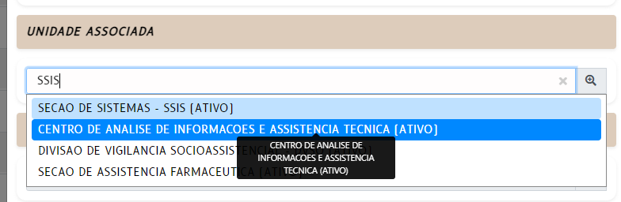

# SELECT-INPUT

React component for a custom HTML form select element

> 

## Dependencies

- React (used 17.0.2)
- Reactstrap (used 8.10.0)
- Font Awesome (used 5.9.0)
- function module (helper)

## Component input (props)

- **optionsData**: json data, specify current element options data
	- must be an ARRAY

- **optionsKeys**: specify property keys in optionsData
	- **id**: unique, the option ID
	- **name**: option mandatory description
	- **nameBold**: optional Boolean - bold format
	- **description1**: optional extra description (first)
	- **description1Bold**: optional Boolean - bold format
	- **description2**: optional extra description (second)
	- **description2Bold**: optional Boolean - bold format
	- **image**: only if there is an image associated with the option
		- **image.src**: base64 image source - mandatory
		- **image.alt**: alt image text - mandatory
	- **active**: Boolean optional, show or not current option (default show)

- **optionsSelected**: current element selected option
	- no ARRAY permitted, only empty strings or primitive current values

- **id**: React form element ID

- **handleFormElements**: Parent state hook function that controls the form element data

- **disabled**: optional, element is enabled or disabled (default enabled)

- **terminators**: optional, terminator for options text concatenating string (if any)
	- name, description1, description2, active
	- Default values:

		```
		[
			['', ''], // name
			[' - ', ''], // description1
			[' - ', ''], // description2
			[' (', ')'] // active
		]
		```

## Example

```
import SelectInput from 'components/_common/_form/SelectInput';

	...

	const [formElements, handleFormElements] = useState(
		{
			...
			unidade: ...
			...
		}
	);

	...

	<Row form>
		<Col md={ 12 }>
			<FormGroup>
				<div id="unidade" data-value={ formElements.unidade }>
					<SelectInput
						optionsData={ data.options && data.options.unidades }
						optionsKeys={ { id: 'id', name: 'nomeUnidade', description1: 'siglaUnidade', active: 'ativo' } }
						optionSelected={ formElements.unidade }
						id="unidade"
						handleFormElements={ handleFormElements }
					/>
				</div>
			</FormGroup>
		</Col>
	</Row>

	...
```
